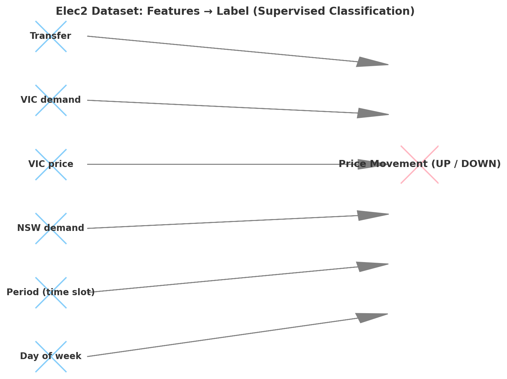

# Concept Drift Datasets

This repository contains **real-world** and **synthetic datasets** widely used in the study of **supervised machine learning under concept drift**. Concept drift occurs when the statistical properties of the target variable change over time, making predictive models less effective if not adapted.

These datasets are commonly used to evaluate and benchmark **adaptive learning systems** such as **Hoeffding Trees**, **Ensembles**, and **incremental learners**.

---

## 📂 Included Datasets

### 1. Electricity (Elec2)
- **Type:** Real-world dataset  
- **Source:** New South Wales (NSW), Australia electricity market  
- **Granularity:** 30-minute intervals  

**Features used:**
- `day` → day of the week (1–7)  
- `period` → time period (continuous, half-hour slot index)  
- `nswdemand` → electricity demand in NSW  
- `vicprice` → electricity price in Victoria  
- `vicdemand` → electricity demand in Victoria  
- `transfer` → electricity transfer between states  

**Label (target):**
- `UP` → Price increased  
- `DOWN` → Price decreased  

**Why it’s important:**  
The Elec2 dataset is widely used because it contains **naturally occurring concept drift**, influenced by market dynamics, seasonality, and demand fluctuations.

---

### 2. SEA Concepts
- **Type:** Synthetic dataset  
- **Idea:** Simulates **sudden changes** in classification rules.  
- **Mechanism:**  
  - Classification threshold changes at regular points in the stream.  
  - Models are tested on how well they adapt to sudden distribution shifts.  

---

### 3. Rotating Hyperplane
- **Type:** Synthetic dataset  
- **Idea:** Simulates **gradual changes** in data distribution.  
- **Mechanism:**  
  - A separating hyperplane is rotated incrementally.  
  - Tests model adaptability to slowly evolving classification boundaries.  

---

## 🧠 Use Case

These datasets are designed for evaluating **supervised classification algorithms** such as:
- Hoeffding Tree
- Decision Trees
- Online Bagging / Boosting
- Adaptive Random Forests
- Streaming Ensemble Models

---

## 📊 Features vs Label Overview (Elec2)

The diagram below illustrates which **features (X)** are used to predict the **label (Y)** in the Elec2 dataset:

- **X (features):**
  - Day of week  
  - Period (time interval)  
  - NSW demand  
  - VIC price  
  - VIC demand  
  - Transfer  

- **Y (label):**
  - Price movement → `UP` or `DOWN`  

---

## 📷 Visualization

The diagram above shows the **supervised learning flow**:  
Blue = input features → Pink = target label.  
This representation helps understand the predictive structure used by algorithms such as **Hoeffding Trees** in adaptive classification tasks.

---
