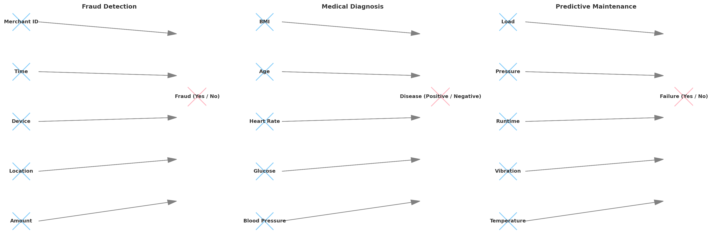

# Concept Drift Datasets

This repository contains **real-world** and **synthetic datasets** widely used in the study of **supervised machine learning under concept drift**. Concept drift occurs when the statistical properties of the target variable change over time, making predictive models less effective if not adapted.

These datasets are commonly used to evaluate and benchmark **adaptive learning systems** such as **Hoeffding Trees**, **Ensembles**, and **incremental learners**.

---

## 📂 Included Datasets

### 1. Electricity (Elec2)
- **Type:** Real-world dataset  
- **Source:** New South Wales (NSW), Australia electricity market  
- **Granularity:** 30-minute intervals  

**Features used:**
- `day` → day of the week (1–7)  
- `period` → time period (continuous, half-hour slot index)  
- `nswdemand` → electricity demand in NSW  
- `vicprice` → electricity price in Victoria  
- `vicdemand` → electricity demand in Victoria  
- `transfer` → electricity transfer between states  

**Label (target):**
- `UP` → Price increased  
- `DOWN` → Price decreased  

**Why it’s important:**  
The Elec2 dataset is widely used because it contains **naturally occurring concept drift**, influenced by market dynamics, seasonality, and demand fluctuations.

---

### 2. SEA Concepts
- **Type:** Synthetic dataset  
- **Idea:** Simulates **sudden (abrupt)** changes in classification rules.  
- **Mechanism:**  
  - Each sample has **three features (`x₁`, `x₂`, `x₃`)**.  
  - Only `x₁` and `x₂` are relevant — `x₃` adds random noise.  
  - The **label (Y)** is `True` if the sum of `x₁ + x₂` exceeds a **threshold (T)**, otherwise `False`.  
  - **Concept drift** occurs when this threshold changes abruptly —  
    for example, switching from `x₁ + x₂ > 8` to `x₁ + x₂ > 9`, creating a **new decision rule**.

**X (features):**  
`{0: x₁, 1: x₂, 2: x₃}` — numeric values per sample  
**Y (label):**  
Binary → `True` (1) or `False` (0)

**Example:**
```python
from river.datasets import synth

# Create two concepts with different thresholds
sea_1 = synth.SEA(variant=0, seed=42)  # concept 1 (x₁ + x₂ > 8)
sea_2 = synth.SEA(variant=1, seed=99)  # concept 2 (x₁ + x₂ > 9)

# Simulate a data stream with an abrupt drift at sample 500
stream = list(sea_1.take(500)) + list(sea_2.take(500))

# Print first few samples
for x, y in stream[:5]:
    print(x, y)
```
---
```
{0: 6.39, 1: 0.25, 2: 2.75} False
{0: 2.23, 1: 7.36, 2: 6.76} True
{0: 8.92, 1: 0.86, 2: 4.21} True
{0: 0.29, 1: 2.18, 2: 5.05} False
{0: 0.26, 1: 1.98, 2: 6.49} False
```

### 3. Rotating Hyperplane
- **Type:** Synthetic dataset  
- **Idea:** Simulates **gradual (continuous)** changes in data distribution.  
- **Mechanism:**  
  - The dataset defines a **hyperplane** — a linear decision boundary separating two classes in a *d-dimensional space*.  
  - Each instance is a point with `n_features` (e.g., 10), where all features contribute to the decision boundary.  
  - The **label (Y)** is determined by which side of the hyperplane the instance lies on.  
  - Over time, the hyperplane’s **orientation and position change slowly**, causing nearby samples to cross the boundary and **change class**.  
  - This models **gradual concept drift**, where the data distribution evolves smoothly rather than abruptly.

**Purpose of multiple features:**  
Unlike the SEA dataset, which has only two relevant features, the Rotating Hyperplane uses **many features (e.g., 10)** to simulate high-dimensional, real-world data.  
All features influence the class, but as the hyperplane rotates, their importance changes continuously — testing how well algorithms can **track slow, multidimensional drifts**.

**X (features):**  
A numeric vector with 10 dimensions → `{x₁, x₂, ..., x₁₀}`  
**Y (label):**  
Binary → `0` or `1`, depending on which side of the hyperplane the point lies on.

**Example:**
```python
from river.datasets import synth

# Simulate a continuously rotating hyperplane (gradual drift)
dataset = synth.Hyperplane(seed=42, n_features=10, drift=0.001)

for x, y in dataset.take(3):
    print(x, y)
```

```
{0: 0.34, 1: 0.62, 2: 0.58, 3: 0.14, ...} 1
{0: 0.76, 1: 0.44, 2: 0.12, 3: 0.59, ...} 0
{0: 0.22, 1: 0.93, 2: 0.52, 3: 0.11, ...} 1
```

---

## 🧠 Use Case

These datasets are designed for evaluating **supervised classification algorithms** such as:
- Hoeffding Tree
- Decision Trees
- Online Bagging / Boosting
- Adaptive Random Forests
- Streaming Ensemble Models

---

## 📊 Features vs Label Overview (Elec2)

The diagram below illustrates which **features (X)** are used to predict the **label (Y)** in the Elec2 dataset:

- **X (features):**
  - Day of week  
  - Period (time interval)  
  - NSW demand  
  - VIC price  
  - VIC demand  
  - Transfer  

- **Y (label):**
  - Price movement → `UP` or `DOWN`  


---

## 📷 Visualization

The diagram above shows the **supervised learning flow**:  
Blue = input features → Pink = target label.  
This representation helps understand the predictive structure used by algorithms such as **Hoeffding Trees** in adaptive classification tasks.

---

---

## 🌍 Future Applications of Concept Drift

While the included datasets (Elec2, SEA Concepts, Rotating Hyperplane) are primarily benchmarks, the **principles of learning under concept drift** apply to many real-world domains:

### 🔐 Fraud Detection
- **Features (X):** Transaction amount, location, device type, time, merchant ID  
- **Label (Y):** Fraudulent transaction (`Yes` / `No`)  
- **Drift source:** Evolving fraud tactics and new attack patterns  

### 🏥 Medical Diagnosis
- **Features (X):** Patient vitals (blood pressure, glucose, heart rate, age, BMI)  
- **Label (Y):** Disease presence (`Positive` / `Negative`)  
- **Drift source:** Seasonal changes, new variants of diseases, shifting population health  

### ⚙️ Predictive Maintenance
- **Features (X):** Sensor readings (temperature, vibration, runtime, pressure, load)  
- **Label (Y):** Machine failure (`Fail` / `No Fail`)  
- **Drift source:** Equipment aging and evolving usage patterns  

---

## 📷 Example Visualization

The diagram below shows how concept drift problems map **features (X)** to **labels (Y)** across domains:



---

